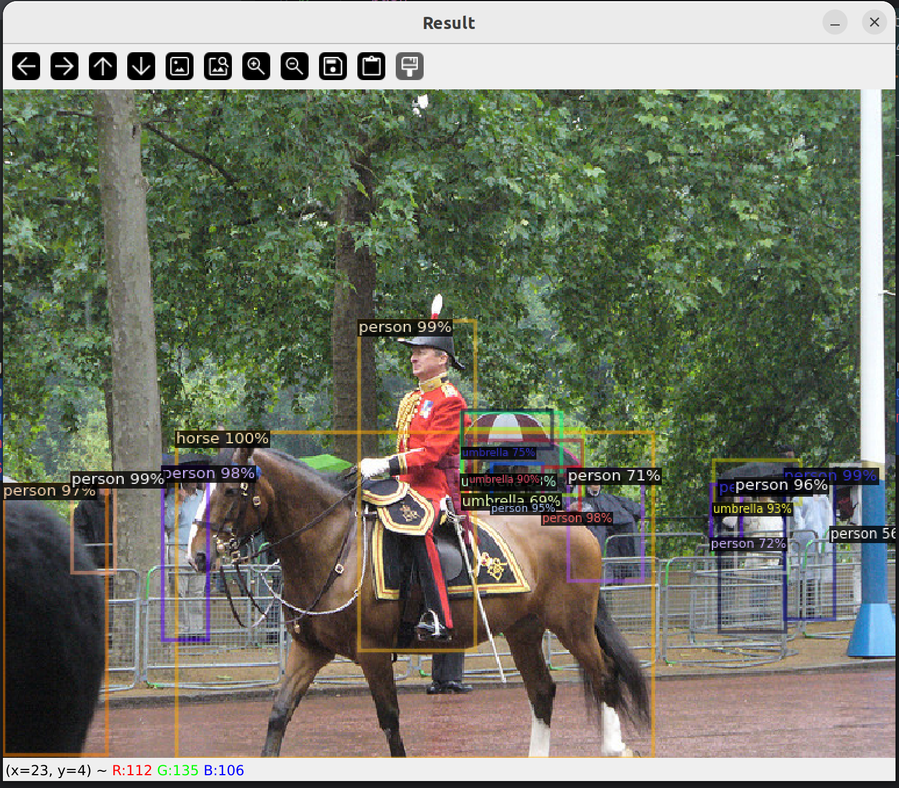

# Foreword
This repo was created as a reference point for detectron2 compared against AMD and Intel GPUs.

# Prerequisites
  * Compatible NVIDIA GPU
  * CUDA-supported OS (e.g., Ubuntu 22.04.3 LTS)

# Getting Started
1. Create a Python Environment
Use mamba to create a new Python environment from an already preconfigured environment.
```bash
mamba env create -f environment.yml
mamba activate detectron2-nvidia
```

2. Running run_detectron2_hello_world should result in the following:

Result Bash:
```bash
[01/01 19:11:28 d2.checkpoint.detection_checkpoint]: [DetectionCheckpointer] Loading from https://dl.fbaipublicfiles.com/detectron2/COCO-Detection/faster_rcnn_R_50_FPN_3x/137849458/model_final_280758.pkl ...
/home/flaniganp/mambaforge/envs/detectron2-rocm/lib/python3.10/site-packages/torch/functional.py:504: UserWarning: torch.meshgrid: in an upcoming release, it will be required to pass the indexing argument. (Triggered internally at ../aten/src/ATen/native/TensorShape.cpp:3483.)
  return _VF.meshgrid(tensors, **kwargs)  # type: ignore[attr-defined]
Warning: Ignoring XDG_SESSION_TYPE=wayland on Gnome. Use QT_QPA_PLATFORM=wayland to run on Wayland anyway.
```

Result Image: 
